## 计算机毕业设计吊打导师hadoop+spark+hive知识图谱股票推荐系统 股票数据分析可视化大屏 股票基金爬虫 股票基金大数据 机器学习 大数据毕业设计 数据仓库 大数据毕业设计 文本分类 LSTM情感分析 大数据毕业设计 知识图谱 大数据毕业设计 预测系统 实时计算 离线计算 数据仓库 人工智能 神经网络

## 要求
### 源码有偿！一套(论文 PPT 源码+sql脚本+教程)

### 
### 加好友前帮忙start一下，并备注github有偿hive股票
### 我的QQ号是2827724252或者798059319或者 1679232425或者微信:bysj2023nb

# 

### 加qq好友说明（被部分 网友整得心力交瘁）：
    1.加好友务必按照格式备注
    2.避免浪费各自的时间！
    3.当“客服”不容易，repo 主是体面人，不爆粗，性格好，文明人。

基础版，也就是当前下面连接这个版本(只带hadoop spark hive flask selenium echarts大屏可视化驾驶舱)

https://www.bilibili.com/video/BV1gu411N7Ti/?spm_id_from=333.999.0.0

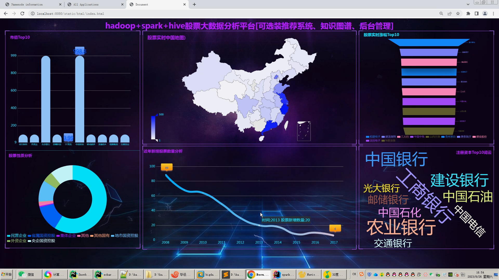
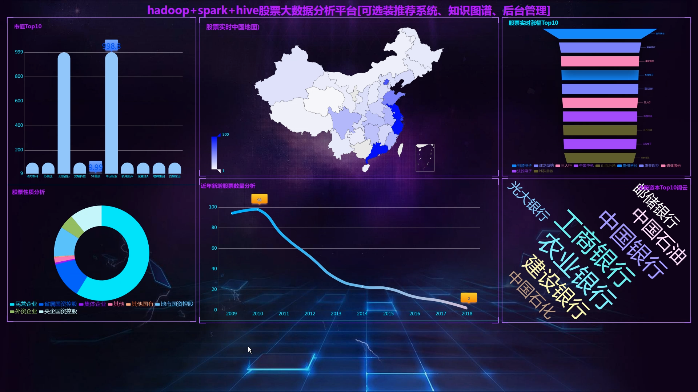
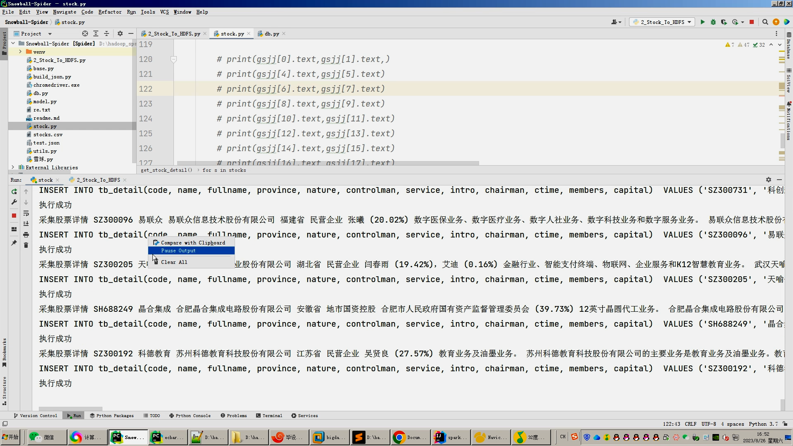
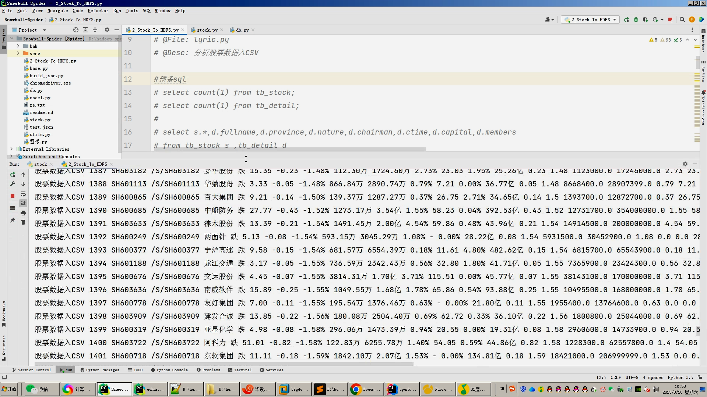

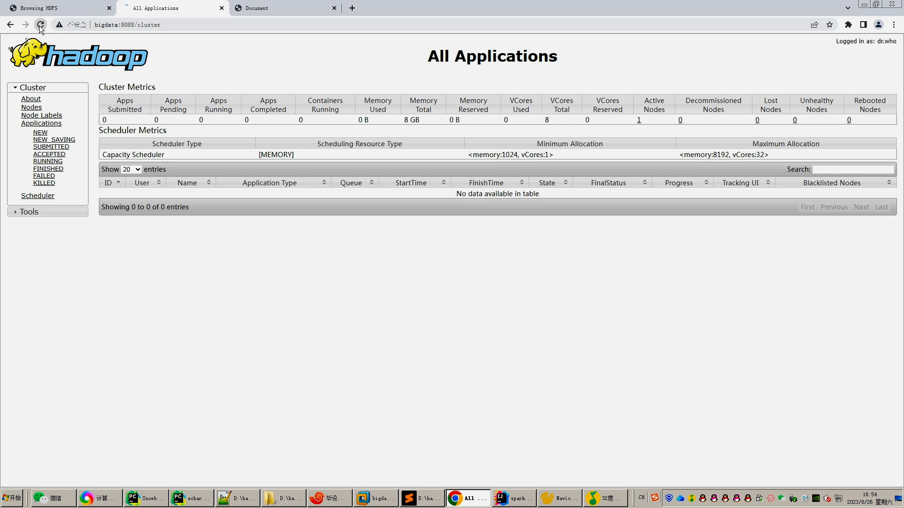
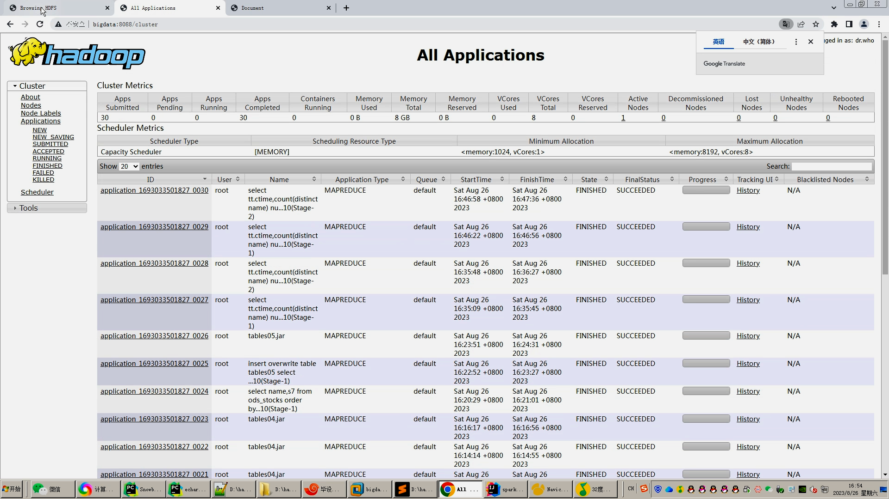
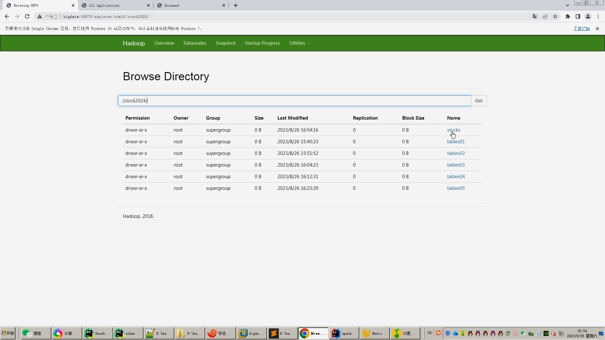
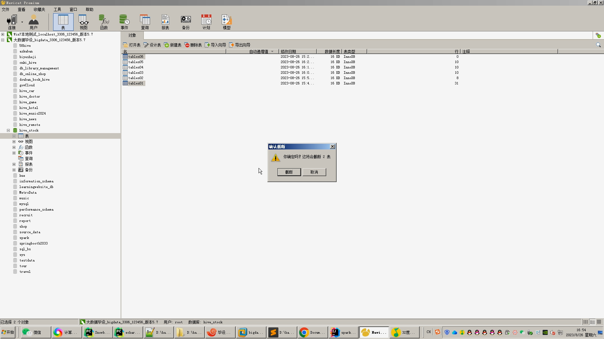
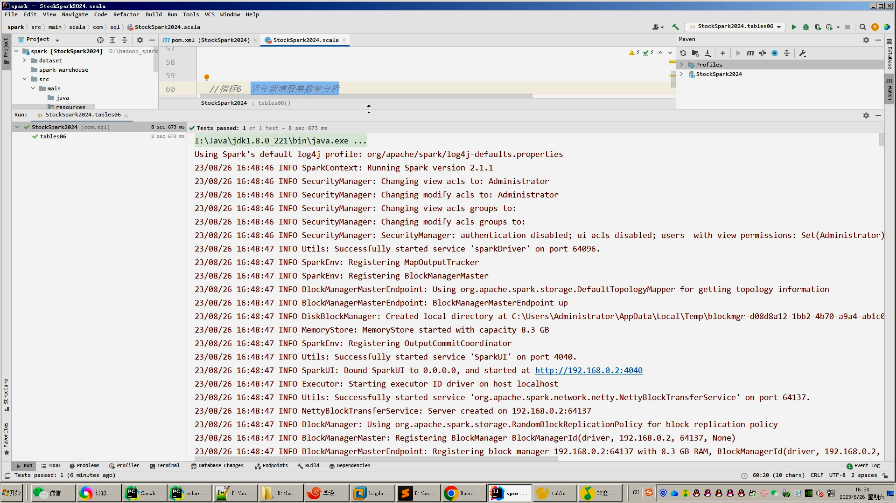
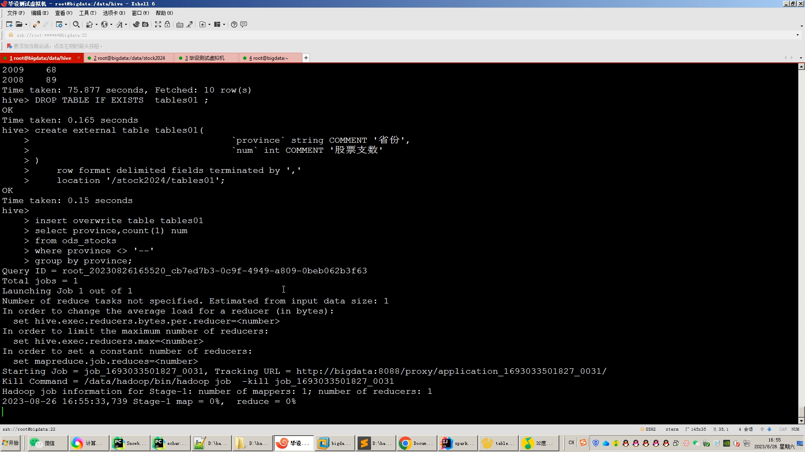
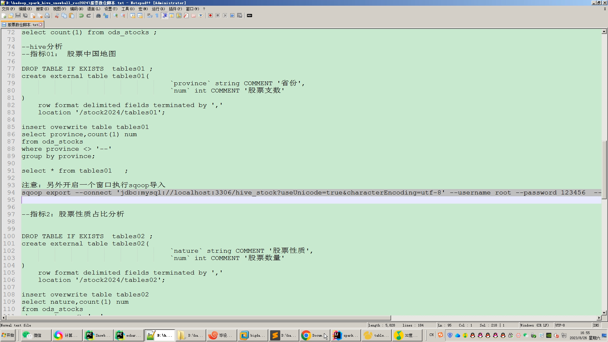

## 开发技术：
spark hadoop hive 装杯显摆虚拟机Linux敲命令炫酷吊打 flask echarts sqoop scala hdfs yarn mysql selenium爬虫框架等；

## 流程： 

1.采集雪球网约50万股票数据存入mysql;
2.使用pandas+numpy或hadoop+mapreduce对mysql中的数据进行数据清洗并转存.csv文件上传到hdfs;
3.使用hive建表建库导入hdfs中的.csv数据集;
4.一半指标使用hive_sql进行离线计算分析，一半指标使用Spark之Scala语法进行实时计算分析；
5.分析结果使用sqoop导入mysql数据库；
6.使用flask+echarts搭建可视化大屏界面；

## 创新点：
Python爬虫、海量数据、可视化大屏、实时+离线计算双实现、spark+hive离线计算实时计算混合开发双实现防止被导师喷

如果他(导师)还是狂喷不止，继续选择以下的系统，他们可以选装牛鼻功能！

## 可选装项目模块如下：
1.推荐系统(4种深度学习推荐算法 协同过滤基于用户 基于物品 SVD神经网络 MLP)。附带AI、支付、短信、lstm情感分析。
2.预测系统(KNN CNN RNN卷积神经预测 K-means 线性回归)。
3.知识图谱neo4j可视化关系网络图。
4.后台管理系统。

注意：以上1234部分均采用springboot+vue.js前后端分离架构！！！

选装视频效果如下：
(如果觉得功能还不够，可以选装推荐系统、预测系统、知识图图谱，可以0秒对接选装，效果如下)
https://www.bilibili.com/video/BV1a14y1R7Cf/?spm_id_from=333.999.0.0
https://www.bilibili.com/video/BV1fN411m7M2/?spm_id_from=333.999.0.0

